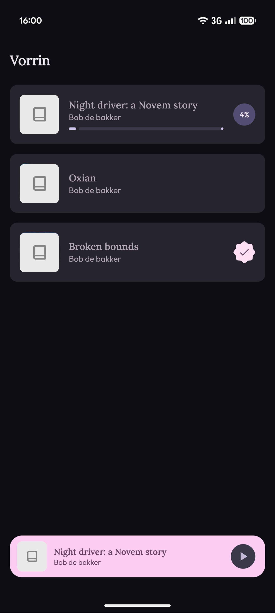
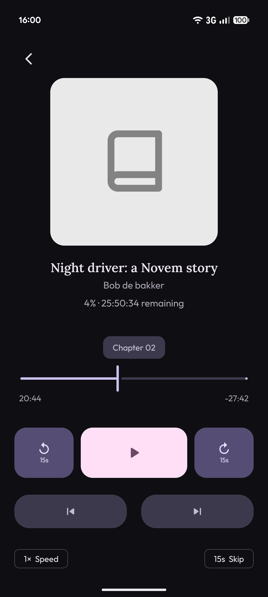

<p align="center">
  
</p>

<h1 align="center">Vorrin</h1>

<p align="center">A native audiobook player for Android, built for <code>.m4b</code> files.</p>

---

Vorrin is a modern Material 3 (Expressive) audiobook app. It was built to replace outdated Play Store apps that hide basic features like: viewing chapters behind paywalls, or fail to send accurate metadata over Bluetooth. 

Vorrin is completely free, open-source, and contains no ads or tracking. Just pick a folder of `.m4b` files on your device and start listening.

## Screenshots

<p align="center">
  
  
</p>

<p align="center"><i>Colors adapt to your device's system theme (Material You).</i></p>

## Download

Get the latest APK directly from the [Releases](../../releases) page. 

*Note: Since this app is open-source and not distributed through the Play Store, you will need to allow installing apps from unknown sources on your Android device.*

---

## Features

- **Accurate Bluetooth & System Metadata** — Displays the current book, author, chapter, and real-time chapter progress correctly in the app and on connected Bluetooth devices.
- **Modern UI** — Built with Material 3 (Expressive) and fully adapts to your Android system color scheme.
- **Playback Speed** — Fine-tune your listening speed directly from the player screen.
- **Configurable Skip Duration** — Change your preferred skip forward/backward intervals on the fly.
- **Chapter & Track Navigation** — View chapter durations and instantly jump to any section without paying a premium.
- **Background Playback** — Full foreground service support with a persistent, controllable media notification.
- **Automatic Progress Saving** — Always remembers exactly where you left off, down to the second.

## Tech Stack

| Layer | Library |
|---|---|
| UI | [Jetpack Compose](https://developer.android.com/jetpack/compose) |
| Design System | [Material 3](https://m3.material.io/) |
| Media Playback | [Media3 (ExoPlayer)](https://developer.android.com/guide/topics/media/media3) |
| Local Database | [Room](https://developer.android.com/training/data-storage/room) |
| Preferences | [DataStore](https://developer.android.com/topic/libraries/architecture/datastore) |
| Image Loading | [Coil](https://coil-kt.github.io/coil/) |

## Project Structure

```
app/src/main/java/nl/deruever/vorrin/
├── ui/
│   ├── library/        # Library screen — book grid with progress indicators
│   ├── player/         # Player screen — controls, chapters, speed, skip duration
│   ├── components/     # Shared UI components (e.g. folder picker)
│   ├── navigation/     # Navigation routes
│   └── theme/          # Material 3 theme, colors, and typography
├── data/
│   ├── db/             # Room database, entities, and DAOs
│   ├── Audiobook.kt    # Core data model
│   ├── BookStatus.kt   # UNREAD / IN_PROGRESS / FINISHED
│   ├── BookRepository.kt
│   └── PreferencesRepository.kt
└── service/
    └── AudiobookService.kt  # Foreground service for background playback
```

## Getting Started (For Developers)

### Prerequisites

- Android Studio Meerkat or newer
- Android SDK 36 (Target SDK)
- A device or emulator running Android 12 (API level 31) or higher

### Installation

1. Clone the repository:
   
```bash
   git clone git@github.com:ivoderuever/vorrin.git
```

2. Open the project in Android Studio.

3. Sync the project with Gradle files.

4. Run the app on your device or emulator.

## License

This project is licensed under the **GNU General Public License v3.0**. See the [LICENSE](LICENSE) file for the full text.

